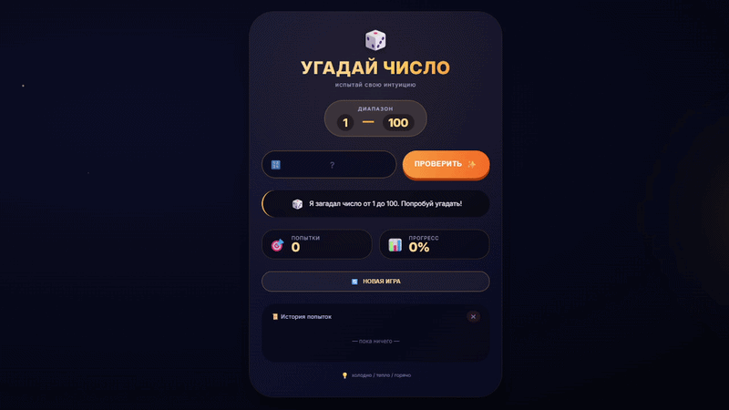

<div align="center">
  
# 🎯 Угадай число

### Магическая игра на интуицию и везение

[](https://html.spec.whatwg.org/)
[](https://www.w3.org/Style/CSS/)
[](https://developer.mozilla.org/ru/docs/Web/JavaScript)


</div>

---

## ✨ Демонстрация
<div align="center">


  
  *🎯 Игрок угадывает число с подсказками «холодно/горячо»*
  </div>
  
---

## 🎮 Об игре

**«Угадай число»** — это захватывающая игра, в которой вам предстоит угадать случайное число от 1 до 100. Каждая попытка сопровождается подсказкой: «холодно», «тепло» или «горячо», что делает процесс ещё интереснее!

### 🌟 Особенности

| Особенность | Описание |
|-------------|----------|
| 🎲 **Случайное число** | Каждая игра уникальна — число генерируется случайно |
| 🔥 **Система подсказок** | Интеллектуальная система «холодно/горячо» |
| 📊 **Отслеживание прогресса** | Визуальный индикатор приближения к цели |
| 📜 **История попыток** | Все ваши догадки сохраняются |
| ✨ **Современный дизайн** | Тёмная космическая тема с плавными анимациями |
| 📱 **Адаптивность** | Игра отлично работает на всех устройствах |

---

## 🚀 Как играть

### Вариант 1: Локальный запуск

```bash
# Клонируйте репозиторий
git clone https://github.com/ваш-username/ugaday-chislo.git

# Перейдите в папку проекта
cd ugaday-chislo

# Откройте index.html в браузере
# (просто дважды кликните по файлу)

Вариант 2: Live Server в VS Code
Установите расширение Live Server

Нажмите правой кнопкой на index.html

Выберите Open with Live Server

🕹️ Правила игры

Действие	Результат
✅ Угадал число	Победа! 🎉
🔥 Разница ≤ 5	Очень горячо!
🌡️ Разница ≤ 15	Тепло! Почти рядом
❄️ Разница ≤ 30	Холодновато
🧊 Разница > 30	Ледяной душ!

🛠️ Технологии

┌─────────────────────────────────────────────────────┐
│                                                     │
│   📄 HTML5    ────    Структура и семантика         │
│                                                     │
│   🎨 CSS3     ────    Стили, анимации, адаптивность │
│                                                     │
│   ⚡ JS       ────    Логика игры, взаимодействие   │
│                                                     │
└─────────────────────────────────────────────────────┘

## 🎮 Управление

<div align="center">
  
| Действие | Клавиша |
|----------|---------|
| **Отправить число** | `Enter` или кнопка **ПРОВЕРИТЬ** |
| **Новая игра** | Кнопка **НОВАЯ ИГРА** |
| **Очистить историю** | Кнопка **✖** в блоке истории |

</div>

---

## 🔮 Планы по улучшению

<div align="center">
  
| Статус | Фича | Описание |
|:------:|:-----|:----------|
| ⬜ | **Выбор уровня сложности** | Легкий, средний, сложный — меняется диапазон чисел |
| ⬜ | **Система рекордов** | Сохранение лучших результатов в localStorage |
| ⬜ | **Звуковое сопровождение** | Приятные звуки при победе и ошибках |
| ⬜ | **Тёмная/светлая тема** | Переключение между темами одним кликом |
| ⬜ | **Анимация при победе** | Праздничный эффект при угадывании числа |
| ⬜ | **Таблица лидеров** | Топ игроков с лучшими результатами |

</div>

---

## 🗺️ Дорожная карта

```mermaid
timeline
    title План развития игры
    section Этап 1
        🎯 Выбор сложности : Добавлен выбор диапазона
        🏆 Система рекордов : Сохранение результатов
    section Этап 2
        🔊 Звуки : Музыкальное сопровождение
        🌓 Тема : Светлая/тёмная тема
    section Этап 3
        ✨ Анимации : Праздничные эффекты
        📊 Таблица лидеров : Глобальный рейтинг
